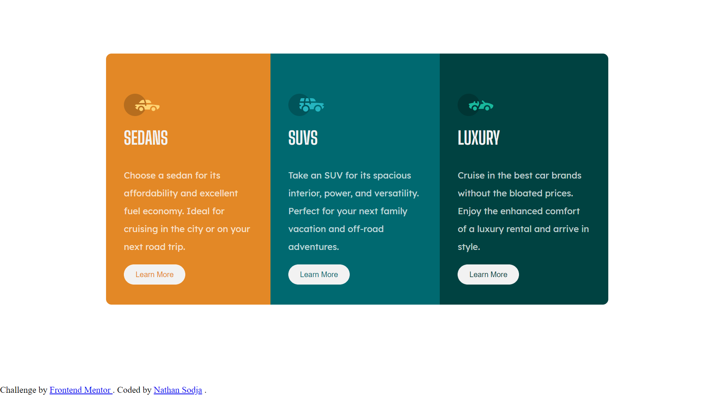
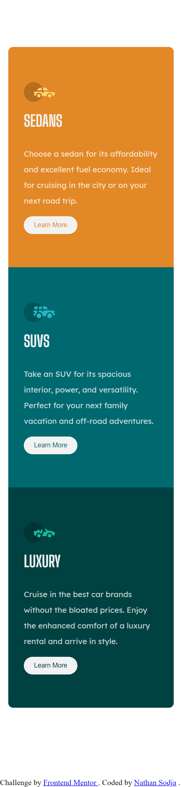

# Frontend Mentor - 3-column preview card component solution

This is a solution to the [3-column preview card component challenge on Frontend Mentor](https://www.frontendmentor.io/challenges/3column-preview-card-component-pH92eAR2-). Frontend Mentor challenges help you improve your coding skills by building realistic projects.

## Table of contents

- [Overview](#overview)
  - [The challenge](#the-challenge)
  - [Screenshot](#screenshot)
  - [Links](#links)
- [My process](#my-process)
  - [Built with](#built-with)
  - [What I learned](#what-i-learned)
  - [Continued development](#continued-development)
  - [Useful resources](#useful-resources)
- [Author](#author)
- [Acknowledgments](#acknowledgments)

## Overview

### The challenge

Users should be able to:

- View the optimal layout depending on their device's screen size
- See hover states for interactive elements

### Screenshot




### Links

- Solution URL: [Github](https://github.com/NateOs/3-column-preview-card-component-main)
- Live Site URL: [Netlify](3-col-fm.netlify.app)

## My process

### Built with

- Semantic HTML5 markup
- CSS custom properties
- Flexbox
- Mobile-first workflow
- SASS
- include-media SASS media query library.

### What I learned

Since this challenge was simple and without much complexitY, I used it to practice my SASS skills and leveled up.

An example query with the @include-media library:

```css
/* sample media query */
/* grey area b/n tablet and phone */
@include media(">phone", "<=desktop") {
  .section {
    display: flex;
    flex-direction: row;
    max-width: 900px;

    &__row {
      min-height: 450px;
      min-width: 280px;
    }
    &__row:first-child {
      border-radius: 10px 0 0 10px;
    }
    &__row:last-child {
      border-radius: 0 10px 10px 0;
    }
  }
}
```

### Continued development

Next stop, tackling fancy ::before and ::after pseudos + transitions

### Useful resources

- [BEM](https://www.example.com) - Refresh your BEM here, works great with SASSing.

## Author

- Website - [Nathan Sodja](https://github.com/nateos)
- Frontend Mentor - [@nateos](https://www.frontendmentor.io/profile/nateos)
